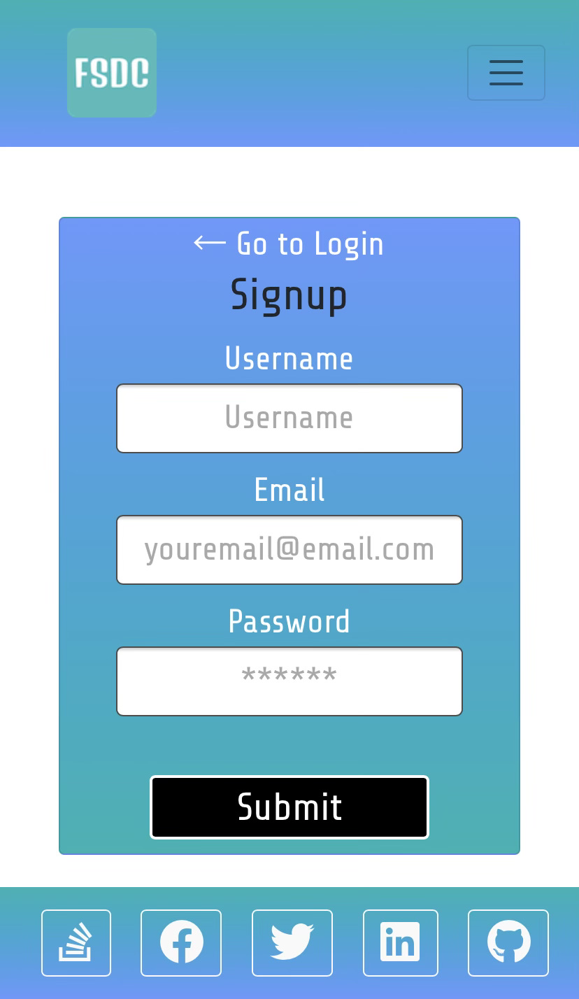
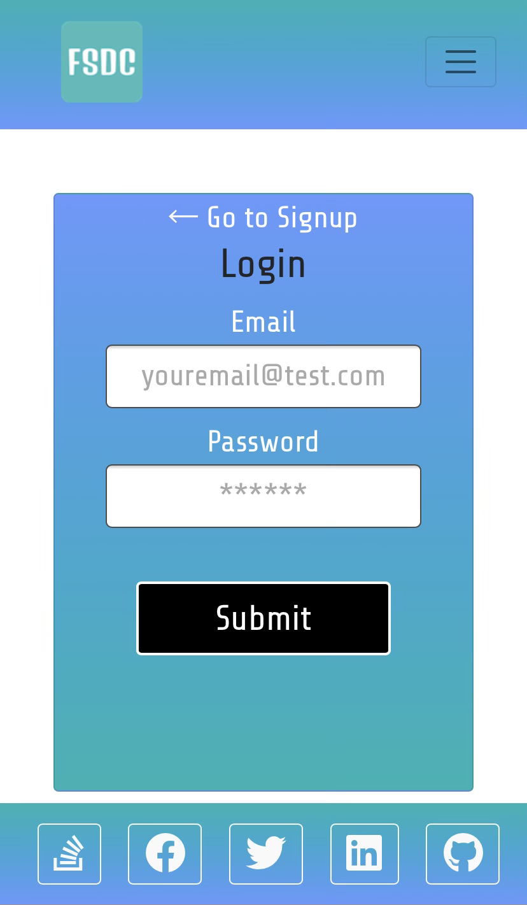
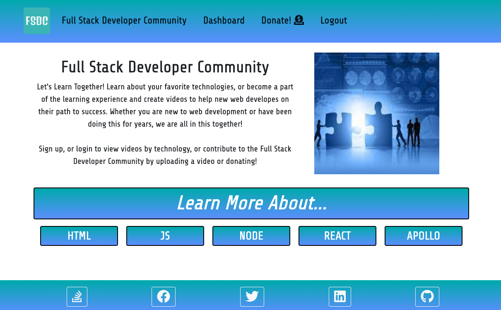
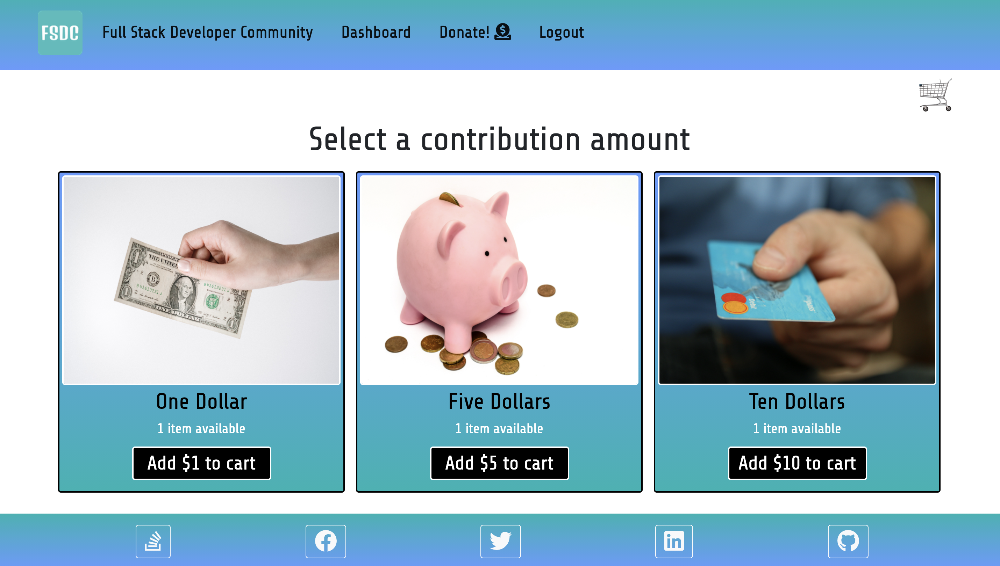

# Full Stack Web Development

    

## Description

Welcome to the [Full Stack Developer Community](https://fullstackdevelopercommunity.herokuapp.com/) where web developers can come together to learn, or contribute to the web developement community! Whether you are new to web development, or are an experienced web developer, this site allows the user the ability to **Login** or **Sign Up** to create their own posts, or view other developers posts by technology. Once logged in the user can use their **Dashboard** to upload a profile picture, enter information about themselves and post their own content (including videos). From the **Home** page they can view all of the avaialble technologies and choose one to view the content for that technology. There is a **Donate** page for members to financially contribute to the [Full Stack Developer Community](https://fullstackdevelopercommunity.herokuapp.com/) and the web developers who use it.

## Table of Contents

- [About the Project](#about-the-project)
- [Installation](#installation)
- [Usage](#usage)
- [Contributing](#contributing)
- [Tests](#tests)
- [License](#license)
- [Questions](#questions)

## About the Project

- This application was designed to be mobile friendly and was designed utilizing the MERN stack with [MongoDB](https://www.mongodb.com/), [Express.js](https://expressjs.com/), [React](https://reactjs.org/) and [Node.js](https://nodejs.org/en/).
- This application relied on [aws-sdk](https://www.npmjs.com/package/aws-sdk) and [graphql-upload](https://www.npmjs.com/package/graphql-upload) to upload videos.
- To view the videos, [react-player](https://www.npmjs.com/package/react-player) was utilized.
- Global State was handled using [redux](https://www.npmjs.com/package/redux).
- The contribution page utilized [stripe](https://www.npmjs.com/package/stripe) to allow the user to donate.
- The [Full Stack Developer Community](https://fullstackdevelopercommunity.herokuapp.com/) allows a user to **Signup** or **Login** to contribute to the web developement community.
- The **Home** page allows a user to view all available technologies, when the click the button, it will bring up all developers who have posted content relating to that technology.
- Once a developer is chosen, they can view their **Profile** page and the developer's posted content.
- The **Dashboard** allows the user to input a profile picture and information about themselves as well as upload content.
- The **Donate!** section allows the user to contribute to the **Full Stack Developer Community** with a donation.

- The **client** folder utilizes the following technologies:

  - [react](https://www.npmjs.com/package/create-react-app)
  - [react-player](https://www.npmjs.com/package/react-player)
  - [redux](https://www.npmjs.com/package/redux)
  - [stripe](https://www.npmjs.com/package/@stripe/stripe-js)
  - [@apollo/client](https://www.npmjs.com/package/apollo-client)
  - [graphQL](https://www.npmjs.com/package/graphql)
  - [Font Awesome Regular Icons](https://www.npmjs.com/package/@fortawesome/free-brands-svg-icons)
  - [Font Awesome Brand Icons](https://www.npmjs.com/package/@fortawesome/free-regular-svg-icons)
  - [Font Awesome Solid Icons](https://www.npmjs.com/package/@fortawesome/free-solid-svg-icons)
  - [react-bootstrap](https://www.npmjs.com/package/react-bootstrap)
  - [bootsrap](https://getbootstrap.com/)
  - [Favicon Generator](https://favicon.io/)
  - [HTML](https://www.w3schools.com/html/), [CSS](https://www.w3.org/Style/CSS/Overview.en.html), and [Javascript](https://www.javascript.com/)
  - [Node.js](https://nodejs.org/en/)

- The **server** folder utilizes the following technologies:

  - [express](https://www.npmjs.com/package/express)
  - [apollo-express-server](https://www.npmjs.com/package/apollo-server-express)
  - [aws-sdk](https://www.npmjs.com/package/aws-sdk)
  - [nanoid](https://www.npmjs.com/package/nanoid)
  - [dotenv](https://www.npmjs.com/package/dotenv)
  - [bcrypt](https://www.npmjs.com/package/bcrypt)
  - [graphql](https://www.npmjs.com/package/graphql)
  - [graphql-upload](https://www.npmjs.com/package/graphql-upload)
  - [jwt-decode](https://www.npmjs.com/package/jwt-decode)
  - [mongoose](https://www.npmjs.com/package/mongoose)
  - [stripe](https://www.npmjs.com/package/stripe)
  - [dotenv](https://www.npmjs.com/package/dotenv)
  - [MongoDB](https://www.mongodb.com/)
  - [Node.js](https://nodejs.org/en/)

- For [Website Deployment](https://fullstackdevelopercommunity.herokuapp.com/) the following technologies were used:
  - [Heroku](https://heroku.com/)
  - [MongoDB Atlas](https://www.mongodb.com/)
  - [if-env](https://www.npmjs.com/package/if-env)

## Installation

- Open [Full Stack Developer Community](https://github.com/twashke/Full-Stack-Developer-Community).
- Use the command line to **git clone**
- **npm install**
- **npm run seed**
- **npm run develop** from command line to connect to server and client.
- Go to [localhost:3000](http://localhost:3000/) for client and [localhost:3001/graphql](http://localhost:3001/graphql) for the server while in development.

## Usage

- Go to [Deployed Full Stack Developer Community](https://fullstackdevelopercommunity.herokuapp.com/).
- **Login** or **Signup** to add, or edit your user profile using the **Dashboard**.
- Use the **Home** page to view all available technologies.
- Once a technology is chosen, the developers with content are displayed.
- Choose a **Developer** to view their profile page and view their content.
- Go to the **Donate** page to contribute to the **Full Stack Developer Community**.

**Signup** Mobile View \

**Login** Mobile View \

**Home** page view \

**Donate** to the Full Stack Developer Community \

## Contributing

- [Donna Crawford](https://github.com/Donnastjames)
- [Gunjan Bhargava](https://github.com/gunjanb)
- [Rex Yu](https://github.com/yu19910513)
- [Tiffany Washke](https://github.com/twashke)
- Further contributions are always encouraged!

## Tests

- Tested throughout Development on Local Computers
- Tested once deployed to [Heroku](https://fullstackdevelopercommunity.herokuapp.com/)

## License

This application is covered by the [MIT License](https://opensource.org/licenses/MIT).

      Copyright 2021 Tiffany Washke

      Permission is hereby granted, free of charge, to any person obtaining a copy of this software and associated documentation files (the "Software"), to deal in the Software without restriction, including without limitation the rights to use, copy, modify, merge, publish, distribute, sublicense, and/or sell copies of the Software, and to permit persons to whom the Software is furnished to do so, subject to the following conditions:

      The above copyright notice and this permission notice shall be included in all copies or substantial portions of the Software.

      THE SOFTWARE IS PROVIDED "AS IS", WITHOUT WARRANTY OF ANY KIND, EXPRESS OR IMPLIED, INCLUDING BUT NOT LIMITED TO THE WARRANTIES OF MERCHANTABILITY, FITNESS FOR A PARTICULAR PURPOSE AND NONINFRINGEMENT. IN NO EVENT SHALL THE AUTHORS OR COPYRIGHT HOLDERS BE LIABLE FOR ANY CLAIM, DAMAGES OR OTHER LIABILITY, WHETHER IN AN ACTION OF CONTRACT, TORT OR OTHERWISE, ARISING FROM, OUT OF OR IN CONNECTION WITH THE SOFTWARE OR THE USE OR OTHER DEALINGS IN THE SOFTWARE.

## Questions

**Contact Donna Crawford**

- **Email directly at** Donnastjames
- **GitHub User Name:** [Donnastjames](https://github.com/Donnastjames)

**Contact Gunjan Bhargava**

- **Email directly at** gunjanb2006@gmail.com
- **GitHub User Name:** [gunjanb](https://github.com/gunjanb)

**Contact Rex Yu**

- **Email directly at** yu19910513
- **GitHub User Name:** [yu19910513](https://github.com/yu19910513)

**Contact Tiffany Washke**

- **Email directly at** twashke@gmail.com
- **GitHub User Name:** [twashke](https://github.com/twashke)

